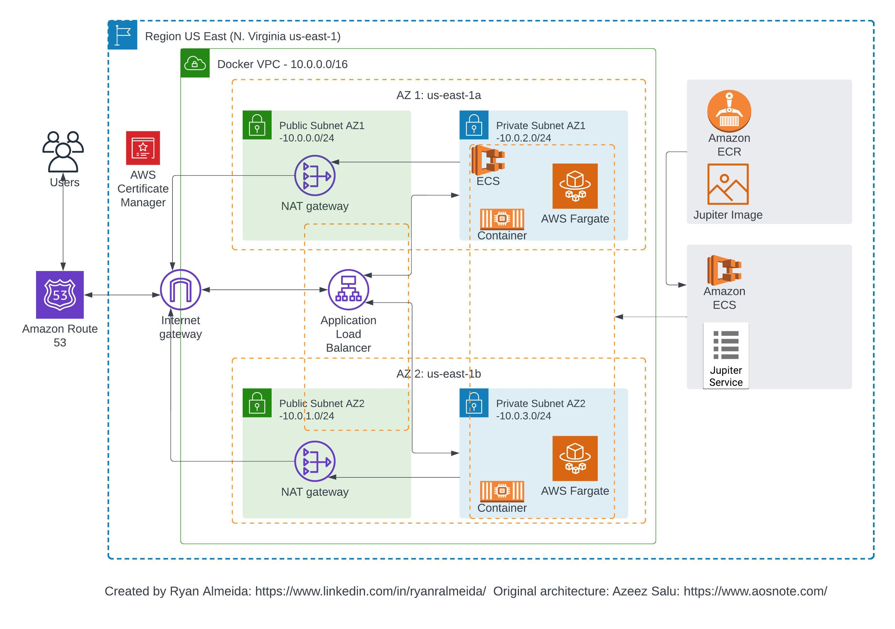

# Deploy a Static Web Application on AWS with Docker, ECR and ECS

## A fully functional EXAMPLE cloud project deployed on AWS to practice implementing containerization tools and services  

This project is an example that was built along with a tutorial series from AOSNOTE (www.aosnote.com) that teaches you how to use Docker, Docker Hub, and AWS specific container services such as Amazon ECS and Amazon ECR to deploy a simple static website on AWS. In particular, this project shows how to do the following:

- Create a Dockerfile
- Build the Container Image
- Push the image to your Docker Hub account
- Create an Amazon ECR Repository to store your image
- Push the Image to your ECR Repository
- Creating a custom VPC in AWS (including Public/Private Subnets, NAT Gateways, Application Load Balancer, and Security Groups)
- Create an ECS Cluster
- Deploy the ECS Cluster within the VPC
- Use Route 53 and AWS Certificate Manager to customize DNS route and secure the website

## Architectural Diagram:
